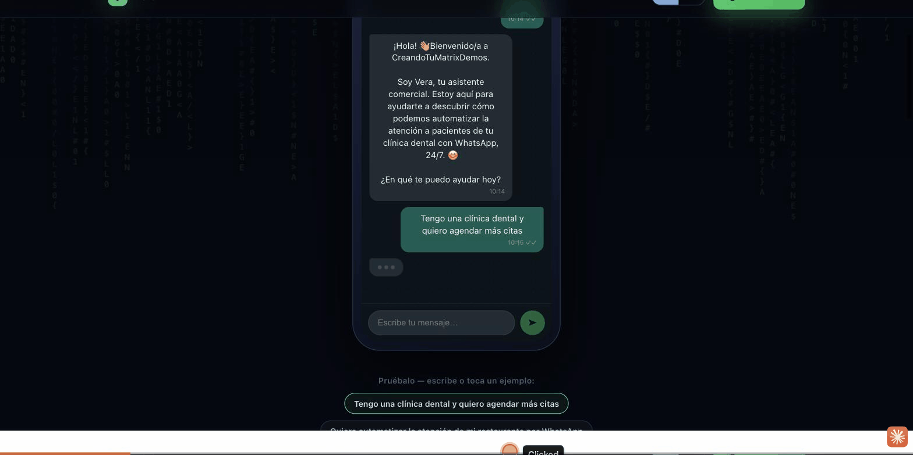

# 📈 Asistente Comercial — Calificador y Agendador de Leads por WhatsApp

Agente de WhatsApp agnóstico al vertical que captura un lead entrante, lo califica contra una rúbrica **configurable** (estilo BANT), lo **puntúa** determinísticamente, **agenda** a los buenos en un Google Calendar real, y los **enruta** al vendedor con un resumen puntuado. Los leads fríos o que no califican reciben una respuesta cortés + un recurso — no un espacio de calendario. Un binario se convierte en un negocio nuevo con solo cambiar `offer.json`.

Construido en Rust (axum + tokio). Integraciones reales: **WhatsApp Cloud API**, **Anthropic** (el cerebro del agente), **Google Calendar**, **HubSpot** (o un webhook CRM genérico).

*Vertical-agnostic WhatsApp agent that captures an inbound lead, qualifies it against a configurable BANT-style rubric, scores it deterministically, books the good ones on a real Google Calendar, and routes them to the rep with a scored summary.*

---

## Demo



- 🔴 **Demo en vivo:** [asistente-comercial-production.up.railway.app](https://asistente-comercial-production.up.railway.app/)
- 📄 **Detalles:** [asistente-comercial-demo.vercel.app](https://asistente-comercial-demo.vercel.app/)

---

## Por qué el scoring es determinístico (la parte defendible)

El LLM **extrae** valores estructurados de la conversación. **No** inventa el score. `src/scoring.rs` aplica la rúbrica de `offer.json` (pesos, tiers de tamaño, escala de timeline, fit de keywords, descalificadores duros/suaves) y devuelve un tier + una lista ordenada y legible de razones. Cada "hot" es reproducible y auditable — el vendedor ve exactamente *por qué*. Corre `cargo test` para ver los casos hot/warm/cold + descalificador.

*The LLM extracts structured values; it does not invent the score. The deterministic rubric engine in `src/scoring.rs` makes every tier reproducible and auditable.*

---

## Arquitectura

```
 Prospecto (WhatsApp)
        │  mensaje entrante (Meta webhook POST)
        ▼
 ┌──────────────────────────────────────────────┐
 │ servidor axum  /webhook  /conversations/:id/... │
 │   • verify (GET)  • receive (POST, ack 200)   │
 └───────────────┬──────────────────────────────┘
                 │ spawn (dedup por message id)
                 ▼
 ┌──────────────────────────────────────────────┐
 │ loop del agente (Anthropic tool-use, es-MX)   │
 │   system prompt + tools armados desde offer.json │
 └───┬───────┬───────┬───────┬───────┬──────────┘
     │       │       │       │       │
  score_  get_     book_   create_ handoff_  send_
  lead    avail.   meeting lead    human    resource
     │       │       │       │       │        │
   rúbrica Google  Google  HubSpot  rep    offer.json
   (Rust)  Calendar Calendar /webhook (WA/web) recursos
     └───────┴───────┴───────┴───────┴────────┘
                 │ historial + leads + meetings
                 ▼
              Postgres
```

Herramientas (dirigidas por `offer.json`): `score_lead`, `get_availability`, `book_meeting`, `create_lead`, `handoff_human`, `send_resource`.

---

## Estructura del repo

```
src/
  main.rs            bootstrap: config → db → clients → router → serve
  config.rs          AppConfig (env) + Offer (superficie white-label de offer.json)
  scoring.rs         motor determinístico de rúbrica (+ unit tests)
  agent/             llm.rs (Anthropic) · prompt.rs (es-MX) · tools.rs · mod.rs (loop)
  whatsapp/          client.rs (envío) · types.rs (payloads del webhook)
  calendar/          mod.rs (trait + matemática de slots) · google.rs (SA JWT + freeBusy + insert)
  crm/               mod.rs (trait) · hubspot.rs · webhook.rs
  notify.rs          handoff al vendedor (WhatsApp/webhook)
  store/             repo de Postgres + models
  server/            webhook.rs · transcript.rs · mod.rs (router)
config/offer.example.json   ← copia a offer.json y edita
migrations/0001_init.sql     (embebido en build time)
scripts/smoke.sh             smoke test del webhook (verify + inbound opcional)
Makefile · Dockerfile · docker-compose.yml · fly.toml · .env.example
```

---

## Requisitos previos

- Rust 1.82+ (`rustup` — fijado vía `rust-toolchain.toml`)
- Docker + Docker Compose (para Postgres, o `docker compose up`)
- Cuentas: Anthropic, Meta (WhatsApp), Google Cloud (service account), HubSpot
- Para webhooks locales: `ngrok` (o `cloudflared`)

---

## Quickstart (local, stack completo)

```bash
cp .env.example .env                 # llena las keys (ver "Credenciales" abajo)
cp config/offer.example.json config/offer.json
mkdir -p secrets && cp /ruta/a/google-sa.json secrets/google-service-account.json

docker compose up --build            # levanta Postgres + la app en :8080
curl localhost:8080/health           # -> ok
```

Sin Docker (Postgres sigue siendo necesario):

```bash
createdb asistente
export DATABASE_URL=postgres://localhost/asistente
cargo run --release
cargo test                           # tests del motor de scoring
```

---

## Muéstralo mañana — el camino sin espera de aprovisionamiento

Lo único que puede bloquear una demo real es la verificación de negocio de Meta. **Sáltatela** con el **número de prueba** que Meta emite al instante en la app de desarrollo (Cloud API real, puede mensajear hasta 5 destinatarios verificados — p.ej. tu propio teléfono).

1. **Expón la app**: `ngrok http 8080` → copia la URL `https://….ngrok-free.app`. Pon `PUBLIC_BASE_URL` en `.env` con esa URL (se usa para los links de transcript). Reinicia la app.
2. **App de Meta**: developers.facebook.com → Create App → agrega el producto **WhatsApp**. En *API Setup* obtienes un **access token temporal**, un **número de prueba**, y su **phone number ID**. Agrega tu número personal en "To".
   - `.env`: `WHATSAPP_ACCESS_TOKEN`, `WHATSAPP_PHONE_NUMBER_ID`.
3. **Configura el webhook**: WhatsApp → *Configuration* → Edit.
   - Callback URL: `https://….ngrok-free.app/webhook`
   - Verify token: cualquier string — debe ser igual a `WHATSAPP_VERIFY_TOKEN` en `.env`.
   - Click **Verify and Save** (llama a nuestro handler GET), luego **Subscribe** al campo `messages`.
4. **Escríbele** desde tu teléfono al número de prueba: *"Hola, vi su anuncio de consultoría"*. El agente califica → puntúa → agenda → enruta.

> El token temporal dura ~24h (suficiente para una demo). Para producción, crea un System User + token permanente y verifica el negocio.

---

## Credenciales

### Anthropic
`ANTHROPIC_API_KEY` desde console.anthropic.com. `ANTHROPIC_MODEL` usa un Sonnet actual por default; puedes sobreescribirlo.

### Google Calendar (service account)
1. Google Cloud Console → habilita la **Google Calendar API**.
2. Crea una **service account**, agrega una **JSON key**. Guárdala como `secrets/google-service-account.json` (o inline en `GOOGLE_SERVICE_ACCOUNT_JSON`).
3. **Comparte el calendario destino** con el email de la service account (`…@…iam.gserviceaccount.com`), permiso **"Make changes to events"**.
4. Pon `offer.json → calendar.calendar_id` al id de ese calendario (`primary` solo funciona para calendarios que la SA *posee*; para el calendario de una persona usa su dirección como id y compártelo). `timezone` es IANA (p.ej. `America/Mexico_City`).

Agendar crea un evento real **con link de Google Meet** y envía el invite por email al prospecto cuando se capturó un email.

### HubSpot (CRM)
`CRM_BACKEND=hubspot`. Crea una **Private App** (Settings → Integrations) con scopes `crm.objects.contacts.write` y `crm.objects.deals.write`; pon el token en `HUBSPOT_TOKEN`. Los leads nuevos hacen upsert de un **contact** + crean un **deal** (con score + razones) y los asocian. Defaults `HUBSPOT_PIPELINE=default`, `HUBSPOT_DEALSTAGE=appointmentscheduled` — cámbialos a los ids de tu pipeline.

¿Prefieres otra cosa? `CRM_BACKEND=webhook` + `CRM_WEBHOOK_URL=` hace POST del lead en JSON a Zapier/Make/n8n/tu API.

### Handoff al vendedor
En `offer.json → handoff`: `channel: "whatsapp"` + `rep_wa_id` (E.164 sin `+`) le manda un DM al vendedor con el resumen puntuado; o `channel: "webhook"` + `webhook_url`. El mensaje incluye un link a `/conversations/:id/transcript`.

---

## White-label: nuevo negocio en minutos

Todo lo específico del vertical vive en `config/offer.json`:

- **branding** — nombre del negocio + agente, locale, tono
- **offer** — resumen, qué vendes, FAQ, política de precios (el agente nunca sobre-cotiza)
- **qualification.slots** — las preguntas a hacer (define el schema de la tool `score_lead`)
- **qualification.rubric** — `weights`, `timeline_scores`, `size_tiers`, `need_keywords`, `thresholds {hot, warm}`, `default_factor_score`
- **qualification.disqualifiers** — duros (fuerzan cold) o `soft` (penalización) por slot (`contains_any` / `equals`)
- **calendar** — id de calendario, timezone, horario laboral, duración de slot, horizonte, días
- **resources** — links por tema para deflection de leads fríos
- **deflection.message** / **handoff** — copy de cierre + destino de ruteo

Cambia el archivo, reinicia → nuevo vertical (clínica, agencia, B2B SaaS, inmobiliaria…). Sin recompilar.

---

## Guión de demo (el wow)

1. **Hot:** "automatizar atención a clientes", *clínica dental*, *3 sucursales*, *este mes* → `score_lead` devuelve **hot** con razones → el agente ofrece slots reales → agenda → confirma nombre/email → enruta al vendedor con el link del transcript.
2. **Cold:** "solo estoy viendo precios, tal vez el otro año" → **cold** → el agente comparte cortésmente un recurso, **sin slot de calendario**. Protege el tiempo del vendedor aplicando criterio, no solo recolectando campos.

Abre la URL impresa `/conversations/:id/transcript` para mostrar el trail completo de decisión.

---

## Build y verificación

```bash
make test             # scoring: hot / warm / cold / descalificador duro + suave / campos faltantes
make fmt-check clippy # formato + lint (clippy trata warnings como errores)
make release          # build optimizado
make smoke            # golpea /health + verify handshake de /webhook (sin efectos secundarios)
make smoke ARGS=--inbound   # o: ./scripts/smoke.sh --inbound  (pipeline completo, APIs en vivo)
```

Los webhooks entrantes se autentican con **HMAC-SHA256** (`X-Hub-Signature-256`) cuando `WHATSAPP_APP_SECRET` está configurado; el script de smoke firma su payload de ejemplo para calzar. El procesamiento por contacto se serializa con un lock en memoria por key (`ConvLocks`).

---

## Limitaciones conocidas / fase 2

- Las respuestas usan la ventana de servicio al cliente de 24h (iniciada por el inbound). Recordatorios proactivos fuera de esa ventana necesitan **message templates** aprobados (`book_meeting` ya guarda la reunión; conectar un template de recordatorio es un cambio pequeño).
- Un solo vendedor / un solo calendario. Round-robin multi-vendedor, follow-ups secuenciados, y enriquecimiento de leads están deliberadamente fuera del alcance del MVP.
- `ConvLocks` es en memoria de proceso; un deploy multi-réplica necesita un lock compartido (p.ej. Postgres advisory locks) — un swap simple detrás de la misma interfaz.

---

## Preguntas frecuentes / FAQ

**¿Funciona con mi número de WhatsApp actual?** — Sí, vía WhatsApp Cloud API. Un número de producción con marca necesita verificación de negocio de Meta; el número de prueba funciona al instante para una demo (ver arriba).
*Yes, via WhatsApp Cloud API — a branded production number needs Meta business verification; the test number works instantly for a demo.*

**¿Cuánto cuesta?** — Depende del vertical y las integraciones (Calendar, CRM). Escríbenos vía [creandotumatrix.com](https://creandotumatrix.com) para una cotización.
*Depends on the vertical and integrations — contact us via creandotumatrix.com for a quote.*

**¿Cómo sé que el score no se lo está inventando el modelo?** — No puede: `src/scoring.rs` aplica la rúbrica de `offer.json` en Rust puro; el LLM solo extrae los valores de los slots. `cargo test` cubre los casos hot/warm/cold + descalificadores.
*It can't — the rubric engine is plain Rust; the LLM only extracts slot values.*

**¿Puedo usar mi propio CRM?** — Sí — `CRM_BACKEND=webhook` manda el lead en JSON a cualquier destino (Zapier/Make/n8n/tu API), además del soporte nativo de HubSpot.
*Yes — a generic webhook CRM backend is supported alongside native HubSpot.*

---

## Asistentes CTM — la familia / the family

Los tres agentes de WhatsApp de **Creando Tu Matrix**, todos sobre el mismo patrón: runtime de tool-use con Claude, guardrails determinísticos en código, y una superficie de configuración white-label por negocio.

| Agente | Qué hace | Repo |
|---|---|---|
| 🌮 **asistente-pedidos** | Pedidos y reservaciones por WhatsApp para restaurantes | [creandotumatrix-labs/asistente-pedidos](https://github.com/creandotumatrix-labs/asistente-pedidos) |
| 🛍️ **asistente-de-tienda** | Soporte y ventas de retail/ecommerce, sobre catálogo real | [creandotumatrix-labs/asistente-de-tienda](https://github.com/creandotumatrix-labs/asistente-de-tienda) |
| 📈 **asistente-comercial** | Calificación y agendado de leads, agnóstico al vertical | [creandotumatrix-labs/asistente-comercial](https://github.com/creandotumatrix-labs/asistente-comercial) |

*The three Creando Tu Matrix WhatsApp agents, all on the same pattern: a Claude tool-use runtime, deterministic guardrails in code, and a per-business white-label config surface.*

🌐 Más sobre CTM: [creandotumatrix.com](https://creandotumatrix.com) · Org: [creandotumatrix-labs](https://github.com/creandotumatrix-labs)

---

Construido por [Marcus Patman](https://github.com/marcuspat) — Principal Agentic Engineer · Parte de **Asistentes CTM** en [creandotumatrix-labs](https://github.com/creandotumatrix-labs)
